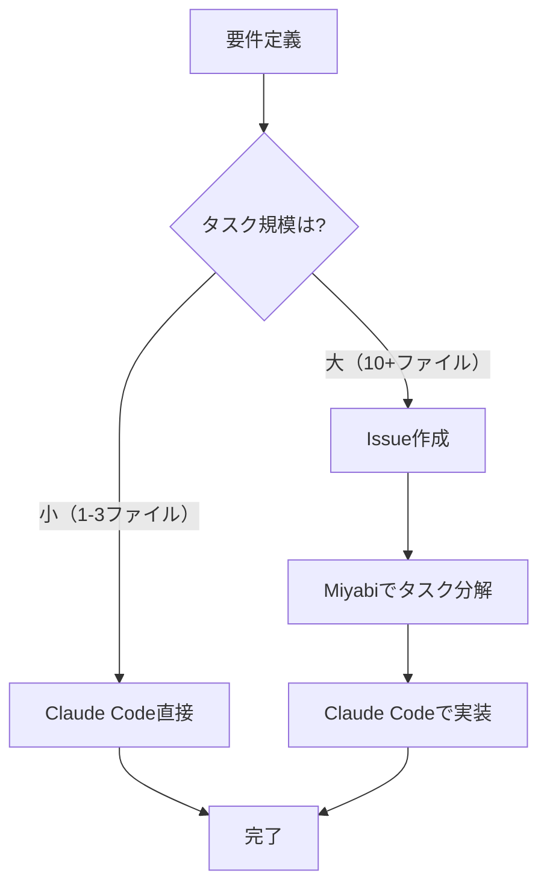

# Miyabi + Claude Code 協調開発ワークフロー

Miyabi（タスク分解エージェント）とClaude Code（AI開発アシスタント）を効果的に組み合わせた開発フローを定義。

## 目的

- 効率的なタスク分解と実装
- 適材適所のツール選択
- 開発速度の最大化
- 品質の維持

## Miyabiの特徴と使いどころ

### Miyabiとは

- Rust製の自律型開発エージェント
- GitHubのIssueを解析してタスク分解（DAG生成）
- LLM設定なしで動作（ルールベース）
- 分解速度: 300〜650ms

### ✅ Miyabiに適したケース

| シチュエーション | 理由 |
|----------------|------|
| 複数ステップに分解できる機能実装（10+ファイル） | タスクの見落とし防止 |
| データベース設計を伴う機能 | マイグレーション、モデル、コントローラー等の依存関係を整理 |
| 複数コンポーネントにまたがる変更 | フロントエンド + バックエンド + DB の整合性確保 |
| 新規機能の設計レビュー | Issue記述を見直す契機に |

**実績例**:
- Issue #2: miyabi+claude協調開発調査 → 4タスク、647ms
- Issue #3: ユーザー役割管理 → 4タスク、397ms
- Issue #4: デプロイ準備 → 4タスク、313ms

### ❌ Miyabiが不要なケース

| シチュエーション | 代わりに |
|----------------|---------|
| 1〜3ファイルの簡単な修正 | Claude Codeで直接実装 |
| バグフィックス | Claude Codeで直接実装 |
| ドキュメント更新のみ | Claude Codeで直接実装 |
| 緊急の修正 | Claude Codeで直接実装 |

## Claude Codeの特徴と使いどころ

### Claude Codeとは

- AnthropicのAI開発アシスタント
- ファイル読み書き、コマンド実行、Git操作が可能
- マルチステップタスクを自律的に実行

### ✅ Claude Codeに適したケース

| シチュエーション | 理由 |
|----------------|------|
| コードの実装・編集 | ファイル操作が得意 |
| デバッグ・エラー解決 | ログ解析、試行錯誤が可能 |
| ドキュメント作成 | Markdown生成が得意 |
| コードレビュー | 品質チェック、提案が可能 |
| 調査・探索 | コードベース分析、外部情報取得 |

## 協調開発パターン

### パターンA: Miyabi First（推奨）

**適用場面**: 複雑な機能実装（10+ファイル）

```
1. Issue作成（gh issue create）
   ↓
2. Miyabiでタスク分解（miyabi agent coordinator --issue N）
   ↓
3. タスクDAGを確認
   ↓
4. Claude Codeで各タスクを順次実装
   ↓
5. コミット・プッシュ
   ↓
6. Issue クローズ
```

**メリット**:
- ✅ タスクの見落としがない
- ✅ 依存関係が明確
- ✅ 進捗管理が容易

**デメリット**:
- ❌ 小規模タスクには過剰

**実践例**:
```bash
# 1. Issue作成
gh issue create --title "ユーザー役割管理機能の実装" --body "..."

# 2. Miyabiでタスク分解
miyabi agent coordinator --issue 3

# 3. 出力確認
# task-3-analysis → task-3-impl → task-3-test → task-3-review
# 推定時間: 60分

# 4. Claude Codeに依頼
"Issue #3の実装をお願いします。Miyabiで分解されたタスクに従って進めてください"

# 5. 完了後
gh issue close 3 -c "実装完了"
```

### パターンB: Claude Code First

**適用場面**: 小規模変更（1〜3ファイル）

```
1. Claude Codeに直接依頼
   ↓
2. 実装
   ↓
3. コミット・プッシュ
   ↓
（Issueは作成しない or 事後作成）
```

**メリット**:
- ✅ 速い
- ✅ 手順がシンプル

**デメリット**:
- ❌ 複雑なタスクには不向き
- ❌ 見落としリスク

**実践例**:
```
User: "ログインページのボタンの色を青に変更して"
Claude Code: （直接実装）
```

### パターンC: Explore First

**適用場面**: 調査・分析後に実装

```
1. Claude Codeで調査・探索
   ↓
2. 調査結果をもとにIssue作成
   ↓
3. Miyabiでタスク分解
   ↓
4. Claude Codeで実装
```

**メリット**:
- ✅ 事前調査で実装方針が明確
- ✅ 適切な粒度でタスク分解

**デメリット**:
- ❌ 調査フェーズが長引くと非効率

**実践例**:
```
User: "Google OAuth認証を追加したい"

1. Claude Code: 調査
   - Laravel Socialiteの確認
   - Google Cloud Console設定の確認
   - コスト調査 → 有料化リスク発見

2. Issue作成: "Google OAuth導入可否の検討"
3. Miyabi: タスク分解（不要 → 調査のみのため）
4. 結論: 見送り（コスト面）
```

## 推奨フロー（一般的なケース）



## タスク粒度の目安

| ファイル数 | タスクの種類 | 推奨パターン | 推定時間 |
|-----------|------------|-------------|---------|
| 1〜3 | バグ修正、小変更 | Claude Code First | 5〜15分 |
| 4〜9 | 中規模機能追加 | Claude Code First | 30〜60分 |
| 10+ | 大規模機能追加 | Miyabi First | 1〜3時間 |

## パフォーマンス比較

| 指標 | Miyabi | Claude Code |
|-----|-------|-------------|
| タスク分解速度 | 300〜650ms | 10〜30秒（手動） |
| 実装速度 | N/A（分解のみ） | 高速 |
| 精度 | 高（ルールベース） | 非常に高（AI） |
| 柔軟性 | 低 | 非常に高 |

## ベストプラクティス

### 1. Issue記述を丁寧に書く

Miyabiのタスク分解精度は、Issue記述の質に依存する。

**Good**:
```markdown
## 概要
ユーザー役割管理機能を実装する。

## 要件
1. usersテーブルにroleカラム追加（enum: user, developer）
2. 開発者アカウント作成（uozmui.engineer@gmail.com）
3. 役割チェック用ミドルウェア作成
4. 開発者用ダッシュボード作成
5. 利用者用ダッシュボード作成
```

**Bad**:
```markdown
役割管理作って
```

### 2. タスクDAGを必ず確認

Miyabiの出力を盲信せず、Claude Codeに実装を依頼する前に確認。

```bash
miyabi agent coordinator --issue 3
# → 出力を確認
# → タスクの抜け漏れがないかチェック
```

### 3. 複雑すぎるIssueは分割

1つのIssueが巨大すぎる場合は、複数のIssueに分割。

**例**:
- Issue #1: 認証機能の実装
- Issue #2: 役割管理の実装
- Issue #3: ダッシュボードの実装

### 4. 定期的にコミット

長時間実装を続けずに、こまめにコミット。

```
マイグレーション作成 → コミット
モデル作成 → コミット
コントローラー作成 → コミット
```

## トラブルシューティング

### Q: Miyabiのタスク分解が粗すぎる

**A**: Issue記述をより詳細に書き直す。具体的なファイル名や実装内容を明記。

### Q: Claude Codeが途中で止まる

**A**: タスクを小さく分割して段階的に依頼。

### Q: MiyabiとClaude Codeのタスクが合わない

**A**: Miyabiの出力を参考程度にし、Claude Codeに自由度を与える。

## まとめ

### 使い分けの基本

- **Miyabi**: 複雑なタスクの「設計図」作成
- **Claude Code**: 実装・デバッグ・ドキュメント作成

### 黄金律

1. **10+ファイル**: Miyabi First
2. **1〜3ファイル**: Claude Code First
3. **調査必要**: Explore First

### 次のステップ

- [技術選定チェックリスト](./TECH_DECISION_GUIDE.md)で技術判断
- [コーディング規約](./CODING_STANDARDS.md)で品質担保
- [ケーススタディ](./CASE_STUDIES.md)で実践例を参照

---

**関連ドキュメント**:
- [MIYABI_CLAUDE_COLLABORATION.md](./MIYABI_CLAUDE_COLLABORATION.md) - pachislot-db-miyabi2の分析
- [技術選定チェックリスト](./TECH_DECISION_GUIDE.md)
- [ケーススタディ](./CASE_STUDIES.md)
